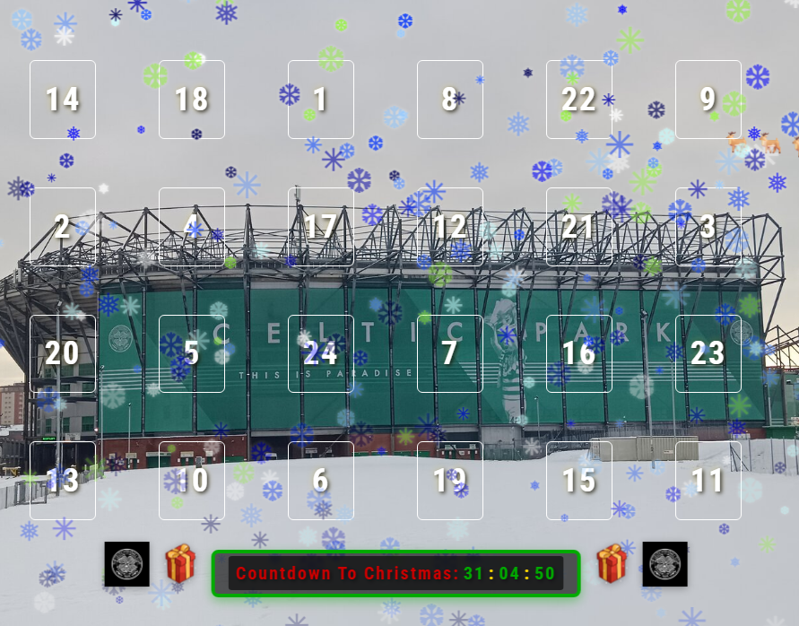
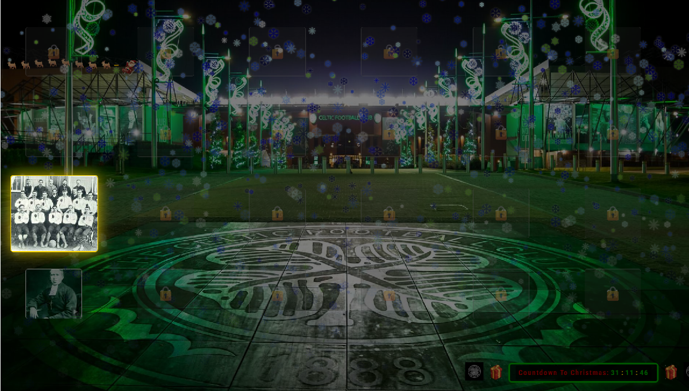
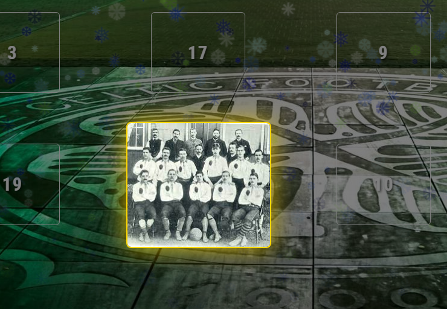
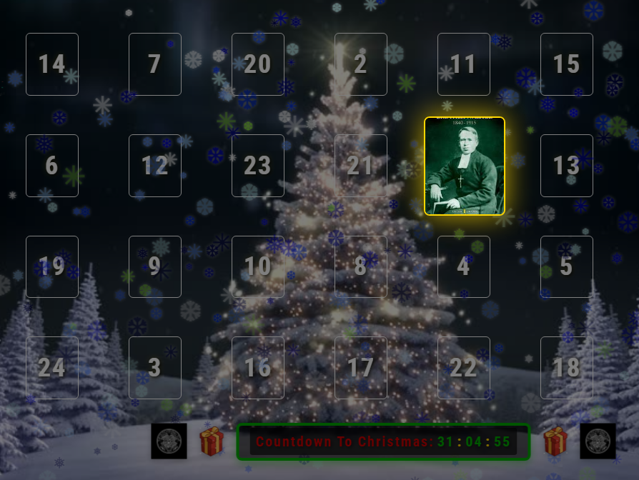

# MMM-MyTeams-Adventskalender
Version 1.1.0
- Author: gitgitaway with AI asistance
- Repository: https://github.com/gitgitaway/MMM-MyTeams-Adventskalender

## Overview
A Glasgow Celtic FC themed advent calendar for the MagicMirror² which commemorates some influential figures and key moments in the club's rich 138 year history as you countdown to Christmas. Although this module has been specifically tailored towards Glasgow Celtic FC and its fans, the module is highly customizable and it can easily be modified to suit other teams or non football related events ( e.g. favorate family Christmas memories down the years ) by simply replacing the image/audio/video media files.  Inspired by and adapted from the wonderfully original MMM-Adventskalender module written by @ChrisF1976.

## Features
- Original Adventskalender 24-door interactive calendar with open/close animations
- Per-door image with optional audio playback with configurable overlay opacity
- Optional per-door video via hardcoded YouTube link or localy saved files in the /video folder
- Background image support with visibility controls (dimming/opacity) during audio overlay
- **17-Language Support**: Full multilingual interface including Christmas Eve Santa message translations
- Snowfall animations (dynamically generated, optimized for all devices)
- Sleigh and animated footer image procession
- Originl Adventskalender Auto-open today's door at a configured time
- Persistent door state saved to disk
- Locked door visual indicators with hover tooltips
- Enhanced countdown text with improved contrast and readability
- **Christmas Eve Special**: Automatic Santa's message + background image change at 23:59:59 on December 24
- **Santa's Trophy Drop System**: Trophies drop sequentially when door 24 opens with smooth 8-second animations
- **Date Override Testing**: Test any date/time without waiting, including Christmas Eve features
- **Optimized for low-power devices** with ~92% reduction in DOM event listeners

## Accessibility Features ♿

**WCAG 2.1 Level AA Compliant** - Fully accessible to users of all abilities:

- ✅ **Keyboard Navigation**: All doors and buttons fully keyboard accessible (Tab, Enter, Space)
- ✅ **Screen Reader Support**: Full ARIA labels, semantic HTML, screen reader tested
- ✅ **Reduced Motion**: Respects `prefers-reduced-motion` preference; disables animations for motion-sensitive users
- ✅ **High Contrast**: Text meets WCAG AA contrast ratios (4.5:1 minimum)
- ✅ **Focus Indicators**: Clear gold focus outlines on keyboard navigation
- ✅ **Locked Door Labels**: Clear visual indicators (🔒) with descriptive tooltips
- ✅ **Optional Audio/Video**: Configurable, doesn't auto-play, user-controlled volume
- ✅ **Mobile Accessible**: Works with touch, keyboard, and mobile screen readers (TalkBack, VoiceOver)

For comprehensive accessibility documentation, **see [ACCESSIBILITY.md](./documentation/ACCESSIBILITY.md)**.

## Performance & Code Quality
- **Efficient Event Handling**: Event delegation pattern reduces memory footprint and improves scalability
- **Clean Architecture**: CSS-first approach with utility classes for styling, JavaScript reserved for logic
- **Consistent Error Handling**: Centralized error handling with debug-friendly logging
- **Device-Friendly**: Specially optimized for Raspberry Pi and other low-power MagicMirror installations

## Screenshots

|  | 
|  | 
|  | 
|  | 


## Installation

Prerequisites
- MagicMirror² installed and running
- Git installed

Clone
- Linux/macOS
  ```
  cd ~/MagicMirror/modules && git clone https://github.com/gitgitaway/MMM-MyTeams-Adventskalender.git
  ```
- Windows PowerShell
```
 
  cd "$HOME/MagicMirror/modules"; git clone https://github.com/gitgitaway/MMM-MyTeams-Adventskalender.git
```
Update
```
 cd ~/MagicMirror/modules/MMM-MyTeams-Adventskalender && git pull
```
Manual install
- Copy the MMM-MyTeams-Adventskalender folder to MagicMirror/modules

## Configuration
Add to config/config.js:

Minimal configuration

```
{
  module: "MMM-MyTeams-Adventskalender",
  position: "top_center"
}
```

Full configuration

```
{
  module: "MMM-MyTeams-Adventskalender",
  position: "fulscren_above",
  config: {
    // ⚠️ IMPORTANT: Language must be set in module config, not global config!
    language: "en",  // en, de, en, es, fr, ga, gd, it, nl, pt, no, sv, fi, da, eu, ar, jp, uk
    
    backgroundImage: "background.jpg" , // place your own background image in the images/ folder
    postDoor24Image: "background24.png",  // Optional: background for 23:59:59 on Dec 24
    doorMargin: 30,
    moduleWidth: "100%",
    moduleHeight: "100%",
    autopen: true,
    autoopenat: "07:30",
    openAnimationTime: "5s",
    onboardingToolTips: false, // If set to true wil give you a brief overview of the module on the first start up

    audioEnabled: true,
    audioVolume: 0.5,
    doorScaleOnAudio: false,
    doorScaleAudioSize: 1.5,
    doorScaleOverlayOpacity: 0.5,
    doorScaleBackgroundMinOpacity: 0.4,

    allowVideoPlay: true,
    videoSource: "folder",  // "hardcoded", // hardcoded links to al videos on youtube / tictoc are in ther modules .js

    footerImageEnabled: true,
    footerImageDirection: "left-to-right",
    footerImageAnimationDuration: 120,
    footerImageCount: 12,
    footerImageSize: 40,
    footerImages: "socks.gif",

    sleighEnabled: true,
    sleighSpeed: 10,
    sleighDirection: "left-to-right",
    sleighImage: "sleigh.gif",

    giftsFromSanta: true,
    giftType: "trophy", // "trophy" or "gift"
    maxGiftsToDrop: 3,
    giftDropDelay: 5,

    closeAllDoors: false, // closes each dor on completion of media or pre test
    testSequentially: false, // wIf set to "true" wil test is al media is available
    randomizeDoorsOnStart: true,
    testDoorDuration: 20, // media duration during test
    dateOverride: null,  // Format: nul, or "YYYY-MM-DD hh:mm:ss", e.g. "2024-12-24 23:59:59" for Christmas Eve test

    snowflakesEnabled: true,
    snowflakeColors: ["#FFFFFF", "#CCFFFF", "#99CCFF", "#6699FF", "#3366FF", "#0033FF", "#0000FF", "#0000AA", "#000055"],
    snowCondition: "Medium", // null, or "Light", "Medium", "Blizzard", "Extreme" to override snowflake counts/speed.
    snowflakeCount: 250,
    snowflakeTypes: 5,
    snowflakeSpeed: 50
  }
}
```

Configuration options

| Option | Type | Default | Description |
| --- | --- | --- | --- |
| language | string | "en" | **⚠️ MUST be in module config, not global config.** Supported: de, en, es, fr, ga, gd, it, nl, pt, no, sv, fi, da, eu, ar, jp, uk. Controls all interface text including Christmas Eve messages. |
| backgroundImage | string or null | null | Background image file name or absolute/HTTP path. If only a file name is provided it is resolved from images/. |
| postDoor24Image | string or null | null | Special background image displayed at 23:59:59 on Christmas Eve (Dec 24). Pairs with Santa's multilingual message. |
| moduleWidth | number or string | 900 | Module width in px or percentage (e.g. "100%" for full screen). |
| moduleHeight | number or string | 700 | Module height in px or percentage (e.g. "100%" for full screen). |
| doorMargin | number | 30 | Spacing between doors. |
| autopen | boolean | true | Auto-open today’s door. |
| autoopenat | string | "00:00" | Time (HH:MM) when the daily door should auto-open. |
| openAnimationTime | string | "5s" | Door open/close animation duration. |
| onboardingToolTips | boolean | false | Show helpful onboarding tooltips on first load to guide new users. |
| audioEnabled | boolean | true | Play audio when a door opens. |
| audioVolume | number | 0.5 | Volume 0.0–1.0. |
| doorScaleOnAudio | boolean | false | Show an enlarged door overlay while audio plays (non-intrusive by default). |
| doorScaleAudioSize | number | 1.5 | Size multiplier for door overlay during audio (1.0–2.0). |
| doorScaleOverlayOpacity | number | 0.5 | Overlay background darkness (0.0–1.0); lower values allow background visibility. |
| doorScaleBackgroundMinOpacity | number | 0.4 | Minimum background image visibility during overlay (0.0–1.0). |
| allowVideoPlay | boolean | true | Enable video popups after audio ends. |
| videoSource | string | "hardcoded" | "hardcoded" for YouTube links in code, or "folder" to play local video files from video/. |
| footerImageEnabled | boolean | true | Show animated footer images and countdown banner. |
| footerImageDirection | string | "left-to-right" | Direction of footer animation ("left-to-right" or "right-to-left"). |
| footerImageAnimationDuration | number | 120 | Duration in seconds for one full footer scroll. |
| footerImageCount | number | 12 | Number of footer images shown. |
| footerImageSize | number | 40 | Not currently used by CSS directly; reserved for future sizing. |
| footerImages | string or array | "socks.gif" | Image file name or array of image file names under images/. |
| sleighEnabled | boolean | true | Show flying sleigh animation. |
| sleighSpeed | number | 10 | Seconds for sleigh to traverse the screen. |
| sleighDirection | string | "left-to-right" | Direction of sleigh movement. |
| sleighImage | string | "sleigh.gif" | Sleigh image under images/ (or absolute/HTTP). |
| giftsFromSanta | boolean | false | Enable gift/trophy drops when door 24 is opened. |
| giftType | string | "trophy" | Type of items to drop: `"trophy"` or `"gift"`. Controls image filename pattern. |
| maxGiftsToDrop | number | 8 | Maximum number of gifts/trophies to drop (1–8). Auto-capped at 8. |
| giftDropDelay | number | 2 | Kept for compatibility; not functional in current version. |
| closeAllDoors | boolean | false | Force-close all doors on load; useful for demos. |
| testSequentially | boolean | false | Opens each door 1-24 sequentially in test mode: closes all doors, then plays audio and video for each door in order, auto-advancing to next door when media ends or is manually closed. |
| randomizeDoorsOnStart | boolean | true | Randomize door positions each start. |
| testDoorDuration | number | 3 | Testing helper (legacy, not used in current sequential mode). |
| dateOverride | string or null | null | Force date and time for testing. Format: `"YYYY-MM-DD hh:mm:ss"`. Example: `"2024-12-24 23:59:59"` to test Christmas Eve features immediately. |
| snowflakesEnabled | boolean | true | Enable snowfall overlay. |
| snowflakeColors | array or string | [various blues/white] | Colors used for snowflakes (array or comma-separated string). |
| snowCondition | string or null | null | Preset: "Light", "Medium", "Blizzard", "Extreme" to override snowflake counts/speed. |
| snowflakeCount | number | 250 | Number of snowflakes (50–1000). |
| snowflakeTypes | number | 5 | Variety of snowflake shapes (1–20). |
| snowflakeSpeed | number | 50 | Fall speed (1–200; higher is faster). |

## Assets
Place media inside the module folder:
- **images/**: 01.jpg … 24.jpg, plus any backgrounds and footer images (e.g. socks.gif, sleigh.gif)
  - **Gift/Trophy images** (optional): Configure with `giftType` and `maxGiftsToDrop`
    - When `giftType: "trophy"`: Looks for trophy1.png/jpg/gif/webp, trophy2.*, trophy3.*, up to trophy8.*
    - When `giftType: "gift"`: Looks for gift1.png/jpg/gif/webp, gift2.*, gift3.*, up to gift8.*
    - Supports formats: `.png`, `.jpg`, `.jpeg`, `.gif`, `.webp`
    - Recommended size: 80×80 pixels (transparent background recommended)
- **audio/**: 01.mp3 … 24.mp3
- **video/**: 01.mp4 … 24.mp4 (only if using videoSource: "folder") nb videos in the video/ folder wil auto play after audio is completed, Hardcoded videos ned user intervention to start

## Usage
- **Normal mode**: Click an unlocked door to open/close it. Audio plays when opened if enabled. After audio ends, an optional video popup opens depending on videoSource and allowVideoPlay.
- **Auto-open**: If autopen is enabled, today's door opens at the time specified in autoopenat.
- **Test Sequential Mode**: Enable testSequentially in config to automatically test all 24 doors in order. The sequence will:
  1. Close all doors
  2. Open door 1, play audio ( play duration set by "testDoorDuration:"), then play video (if enabled)
  3. Continue to door 2 when video ends, is manually closed, or after 2-second timeout if video fails
  4. Repeat steps 2-3 for all 24 doors
  5. Detailed logging is output to the browser console for debugging

## Maintenance
- Update:
  ```
  cd ~/MagicMirror/modules/MMM-MyTeams-Adventskalender && git pull

- Reset state: stop MagicMirror and delete state.json in the module folder; it will be recreated on next start.

## Troubleshooting
- Doors locked too early/late: check system date/time and autoopenat.
- No images/audio/video: verify files exist and are correctly named in images/, audio/, video/.
- Audio blocked: browsers may block autoplay; ensure interaction or allow sound in the browser.
- Popup blocked: allow popups for MagicMirror Electron or your browser for YouTube/local videos.
- Performance issues on Raspberry Pi: reduce snowCondition ( try Medium or Light or set to nul ) , reduce snowflakeCount (try 100-150), lower snowflakeSpeed, or disable doorScaleOnAudio.
- Debug errors: enable `debug: true` in config to see detailed error context in browser console (F12).
- Module not responsive: verify MagicMirror is fully loaded; check browser console for any error messages.

## Notes
- This module uses dynamic content generation for optimal performance and responsiveness.
- For best results, use high-resolution images and videos that match the dimensions specified in the config.
- Tested on MagicMirror² v2.18.x but should work with earlier versions.
- Tested on Raspbery Pi 3B, 4  & on Windows 11 with Electron v10.3.x and later versions.
- All media included in this repository is for demonstration purposes and should be replaced with media you own or have a licence to use for personal use . 
- The author does not claim ownership over any of the media assets used in this module.

## License
See LICENSE.

## Credits
- Original advent calendar concept by @ChrisF1976 (MMM-Adventskalender)

